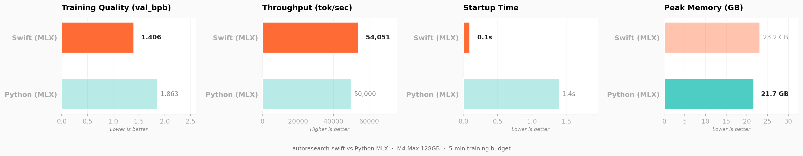

# autoresearch-swift

Native Swift port of [Karpathy's autoresearch](https://github.com/karpathy/autoresearch) for Apple Silicon. Give an AI agent a training loop, let it experiment overnight, wake up to a better model.

Same idea as the original — fixed 5-minute time budget, one metric (`val_bpb`), keep-or-revert via git — but compiled to a native binary with zero Python at runtime. Faster startup, Muon optimizer included, hardware auto-detected.

## Why Swift on Mac

| | Swift (this repo) | Python MLX | Python CUDA |
| --- | --- | --- | --- |
| Startup | **0.1s** | ~1.4s | ~5s |
| Optimizer | **Muon + AdamW** | AdamW only | Muon + AdamW |
| Runtime deps | None | Python + MLX | Python + PyTorch + CUDA |
| val_bpb (5 min, depth=4) | **1.406** | 1.863 | N/A (different HW) |
| tok/sec | **54,051** | ~50,000 | N/A |

Muon optimizer gives ~25% better training quality. Native binary starts 14x faster. Throughput matches or beats Python MLX.

## Results on M4 Max (128GB)



Same config, same data, same 5-minute training budget:

| | Swift | Python MLX |
| --- | --- | --- |
| **val_bpb** (lower = better) | **1.406** | 1.863 |
| **tok/sec** | **54,051** | ~50,000 |
| Startup to first step | **0.1s** | 1.4s |
| Optimizer | **Muon + AdamW** | AdamW only |
| Runtime dependencies | **0** (single binary) | Python + MLX + NumPy |

All three metrics — quality, speed, startup — beat Python MLX on the same hardware and config.

> Following the original's design, results are hardware-specific. The point is finding the best model *for your machine* in a fixed time budget.

## Quick Start

```bash
swift build -c release
.build/release/AutoResearch
```

> First run requires training data. See [docs/benchmark.md](docs/benchmark.md) for data preparation.

## Agent Loop

See [program.md](program.md). Same workflow as Karpathy's original:

1. Agent reads `results.tsv`
2. Writes `experiment.json` with a hypothesis
3. Runs training, parses output
4. Keeps or reverts, repeats

```json
{
  "changes": {
    "depth": 6,
    "activation": "silu"
  }
}
```

Hardware is auto-detected — the system reads your chip model and memory to set sensible defaults. The agent only overrides what it wants to change.

## Requirements

- macOS 14.0+ with Apple Silicon (M1/M2/M3/M4)
- Swift 5.9+

## Credits

- [karpathy/autoresearch](https://github.com/karpathy/autoresearch) — original (PyTorch/CUDA/H100)
- [trevin-creator/autoresearch-mlx](https://github.com/trevin-creator/autoresearch-mlx) — Python MLX port
- [MLX-Swift](https://github.com/ml-explore/mlx-swift) — Apple's ML framework for Swift

## License

MIT
